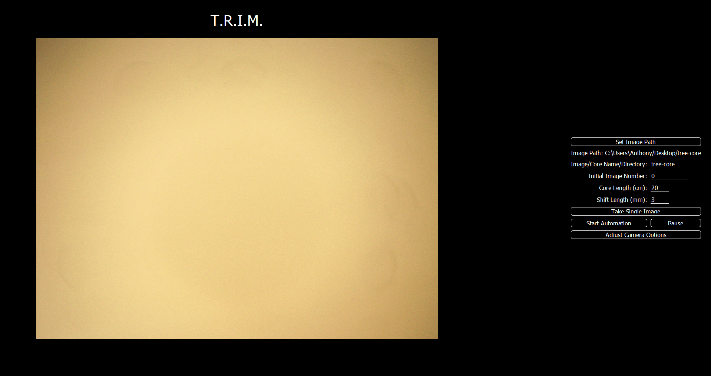

# Instructions for Use

1. Open the Application.

     

2. Setup your tree ring sample on the tray, so it is at the left edge of the microscope camera. Make sure too focus the camera properly.

3. Set the path where you would like TRIM to put the images.

4. Input your sample length (default is 20cm), and the amount you would like shift the sample each time (default is 3mm).

5. Select "Start Automation".

6. Let the script run. When it finishes it will say "Automation Stopped".
